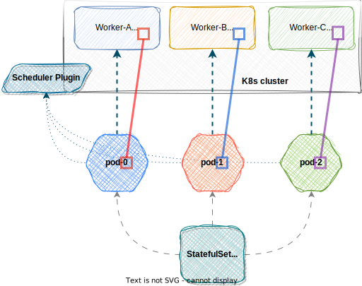

# k8s-sts-scheduler

StatefulSetScheduler is a Kubernetes scheduler plugin that extends the default scheduler behavior by adding additional constraints for scheduling StatefulSet pods. It takes into account pod's index and node's label match.

This plugin is especially useful when you want to ensure that each Pod of a StatefulSet is placed on a specific Node, according to the Node's label and Pod's ordinal index.

<p align="center"></p>

## Features

- Checks if the Pod is owned by a StatefulSet.
- Validates if the Pod's labels match the expected labels.
- Verifies if the Node has the necessary label to be considered for scheduling.
- Ensures that the Pod's ordinal index matches the Node's label value.

## Getting Started

### Prerequisites

- Kubernetes cluster
- `kubectl` command-line tool

### Installation

To deploy the StatefulSetScheduler in your Kubernetes cluster, you can use the provided Kubernetes configuration file `sts-scheduler.yaml` located in the `examples` directory.

This scheduler plugin is configured through environment variables. Here are the key variables to set:

- `STS-SCHEDULER_LABELS_POD`: List of labels to match for a Pod to be considered by the StatefulSetScheduler (any of the list).
- `STS-SCHEDULER_LABELS_NODE`: Label to match for a Node to be considered suitable for scheduling a Pod.

Example:

```
STS-SCHEDULER_LABELS_POD="example.io/kind"
STS-SCHEDULER_LABELS_NODE="example.io/node"
```

Also set labels to nodes:

```bash
kubectl label nodes <node-name> <label-key>=<label-value>
```

Example:

```bash
kubectl label nodes srv-k8s-worker-A example.io/node=0
kubectl label nodes srv-k8s-worker-B example.io/node=1
kubectl label nodes srv-k8s-worker-C example.io/node=2
```

## Usage

Once the StatefulSetScheduler is running in your cluster, you can specify that your StatefulSets should use it by adding the `schedulerName` field and labels to your StatefulSet's spec:

```yaml
apiVersion: apps/v1
kind: StatefulSet
metadata:
  name: my-statefulset
spec:
  replicas: 3
  serviceName: my-service
  template:
    metadata:
      labels:
        example.io/kind: sts-service
  template:
    metadata:
      labels:
        name: my-statefulset
        example.io/kind: service-kind
    spec:
      schedulerName: sts-scheduler
  ...
```

Example `sts-application.yaml` located in the `examples` directory.

## License

This project is licensed under the MIT License - see the [LICENSE](LICENSE) file for details.

## Support

If you encounter any issues, please open an issue on the GitHub repository. We'll do our best to address it promptly.

## Acknowledgements

This project uses the [Kubernetes Scheduler Framework](https://kubernetes.io/docs/concepts/scheduling-eviction/scheduling-framework) to extend the default Kubernetes scheduler functionality.