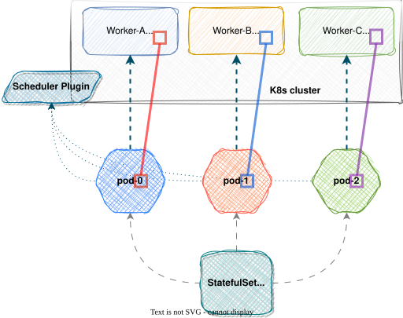

# k8s-sts-scheduler

`StatefulSetOrdinal` is a Kubernetes Scheduler Framework plugin that schedules
a StatefulSet Pod only onto Nodes with the same ordinal.

It matches:

* the Pod ordinal from `apps.kubernetes.io/pod-index`;
* the Node ordinal from the configured `nodeOrdinalLabel`.

For example, Pod `app-2` can be scheduled only onto Nodes whose configured
ordinal label is `2`.

The constraint is fail-closed and applies at scheduling time only.

<p align="center">
  
</p>

## Scheduling contract

The plugin applies only to Pods controlled by an `apps/v1` StatefulSet.

For those Pods:

* `apps.kubernetes.io/pod-index` must contain a valid non-negative 32-bit
  decimal integer;
* each candidate Node must provide a valid ordinal through `nodeOrdinalLabel`;
* a Node is accepted only when its ordinal equals the Pod ordinal;
* missing, invalid, negative, or mismatched ordinals fail closed;
* if multiple Nodes have the required ordinal, all remain candidates for the
  remaining scheduler plugins.

Pods not controlled by an `apps/v1` StatefulSet are ignored by this plugin.
Setting `apps.kubernetes.io/pod-index` manually does not opt another workload
type into ordinal scheduling.

The plugin adds only the ordinal constraint. Standard scheduler mechanisms such
as node affinity, taints and tolerations, topology spread, and resource checks
continue to apply normally.

If no Node satisfies all scheduling constraints, the Pod remains `Pending`.

### Scheduling only

The constraint is evaluated during scheduling.

Changing or removing a Node ordinal label does not evict or move an already
running Pod. The change affects only subsequent scheduling attempts.

Continuous enforcement requires a separate reconciliation mechanism such as a
controller or descheduler policy.

## Compatibility

Kubernetes v1.32 or later is required because the scheduling contract relies on
the StatefulSet `apps.kubernetes.io/pod-index` label.

## Scheduler configuration

Enable the plugin at both the `PreFilter` and `Filter` extension points:

```yaml
apiVersion: kubescheduler.config.k8s.io/v1
kind: KubeSchedulerConfiguration

profiles:
  - schedulerName: sts-scheduler
    plugins:
      preFilter:
        enabled:
          - name: StatefulSetOrdinal
      filter:
        enabled:
          - name: StatefulSetOrdinal

    pluginConfig:
      - name: StatefulSetOrdinal
        args:
          nodeOrdinalLabel: scheduling.example.com/ordinal
```

`nodeOrdinalLabel` is required and must be a valid Kubernetes label key.

See [`examples/scheduler-config.yaml`](examples/scheduler-config.yaml) for the
complete configuration.

## Quick start

### 1. Deploy the scheduler

Deploy the example scheduler:

```bash
kubectl apply -k examples

kubectl -n kube-system rollout status deployment/sts-scheduler
```

> Production deployments should pin a validated release, preferably by immutable image digest.

### 2. Label Nodes

Assign an ordinal to each Node that should host StatefulSet replicas.

For a three-replica StatefulSet:

```bash
kubectl label node srv-k8s-worker-A \
  scheduling.example.com/ordinal=0 \
  --overwrite

kubectl label node srv-k8s-worker-B \
  scheduling.example.com/ordinal=1 \
  --overwrite

kubectl label node srv-k8s-worker-C \
  scheduling.example.com/ordinal=2 \
  --overwrite
```

The ordinal label key must match `nodeOrdinalLabel` in the scheduler
configuration.

Ordinal values do not need to be globally unique. Multiple Nodes may use the
same ordinal; if they otherwise satisfy the Pod's scheduling constraints, all
remain valid candidates.

### 3. Configure the StatefulSet

Configure the workload to use the custom scheduler:

```yaml
spec:
  template:
    spec:
      schedulerName: sts-scheduler
```

Kubernetes automatically adds `apps.kubernetes.io/pod-index` to StatefulSet
Pods. The plugin uses that value as the required ordinal.

See
[`examples/sts-application.yaml`](examples/sts-application.yaml)
for the complete StatefulSet and headless Service example.

### 4. Deploy the application

After the scheduler is ready and the Nodes are labeled:

```bash
kubectl apply -f examples/sts-application.yaml
```

## Verification

Inspect the configured Node ordinals:

```bash
kubectl get nodes \
  -L scheduling.example.com/ordinal
```

Inspect the StatefulSet Pods, their Kubernetes-assigned indexes, and selected
Nodes:

```bash
kubectl get pods \
  -l app=app \
  -L apps.kubernetes.io/pod-index \
  -o wide
```

For the example StatefulSet, `app-N` should run on a Node whose
`scheduling.example.com/ordinal` value is `N`.

For example:

```text
app-0 -> ordinal=0
app-1 -> ordinal=1
app-2 -> ordinal=2
```

All other standard scheduling constraints must also be satisfied.

## Troubleshooting

If a Pod remains `Pending`, inspect its scheduling events:

```bash
kubectl describe pod app-0
```

For scheduler-side diagnostics:

```bash
kubectl -n kube-system logs \
  -l app=sts-scheduler,component=scheduler \
  --prefix=true \
  --tail=200
```

Common causes include:

* no Node has the required ordinal;
* the Pod index or Node ordinal is missing or invalid;
* the Node ordinal does not match the Pod index;
* another scheduling constraint rejects the matching Nodes;
* the custom scheduler is not ready.

## Production considerations

Before using the scheduler for production workloads:

* pin the scheduler image to an immutable release or digest;
* ensure every required StatefulSet ordinal has sufficient Node capacity;
* keep topology and other placement policies separate from the ordinal label;
* monitor the custom scheduler independently from the default scheduler;
* alert on StatefulSet Pods that remain `Pending`;
* treat Node ordinal changes as scheduling-time changes only;
* enforce scheduler replica fault-domain separation explicitly if soft
  anti-affinity is insufficient for your availability requirements.

## License

This project is licensed under the MIT License. See
[`LICENSE`](LICENSE) for details.

## Support

When opening an issue, include the affected Pod specification and events, the
Pod's `apps.kubernetes.io/pod-index` value, relevant Node labels, scheduler
configuration, and scheduler logs.
